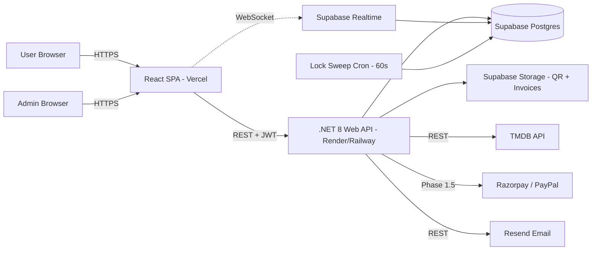

# BookKaroo — Architecture (v2)

> **v2 changes:** Fixed namespace references (TicketVerse → BookKaroo), expanded section stubs.
> Compare with ARCHITECTURE.md — user to decide which to keep.

---

## 1. System Overview



---

## 2. Layered Architecture

### Backend (.NET 8) — Correct Namespaces

```
BookKaroo.Api            ← HTTP layer (controllers, middleware, background services)
   │
BookKaroo.Application    ← Business logic (services, DTOs, validators, interfaces)
   │
BookKaroo.Domain         ← Pure entities, enums (zero dependencies)
   │
BookKaroo.Infrastructure ← EF Core, repositories, external APIs (Resend, TMDB, payment providers)
```

### Frontend (React 18)

```
src/
├── app/        ← Router, providers, error boundary
├── features/   ← Feature-first modules (auth, movies, booking, events, admin, ...)
├── shared/     ← Reusable components, hooks, lib, stores, types, constants
└── design/     ← Design system tokens and showcase
```

Full structure: [docs/FRONTEND.md](FRONTEND.md)

---

## 3. Payment Provider Abstraction

```csharp
// BookKaroo.Application/Interfaces/IPaymentProvider.cs
public interface IPaymentProvider
{
    string ProviderName { get; }
    Task<PaymentOrder> CreateOrderAsync(CreateOrderRequest req, CancellationToken ct);
    Task<PaymentCapture> CaptureAsync(string providerOrderId, CancellationToken ct);
    Task<RefundResult> RefundAsync(string providerPaymentId, decimal amount, CancellationToken ct);
    Task<bool> VerifyWebhookSignatureAsync(string payload, string signature, CancellationToken ct);
}
```

| Class | Location | Phase |
|-------|----------|-------|
| `MockPaymentProvider` | `BookKaroo.Infrastructure/Payment/` | Phase 1 MVP |
| `RazorpayPaymentProvider` | `BookKaroo.Infrastructure/Payment/` | Phase 1.5 |
| `PayPalPaymentProvider` | `BookKaroo.Infrastructure/Payment/` | Phase 1.5 alt |

**DI Registration (Program.cs):**
```csharp
builder.Services.AddScoped<IPaymentProvider>(sp =>
    builder.Configuration["PAYMENT_PROVIDER"] switch {
        "razorpay" => sp.GetRequiredService<RazorpayPaymentProvider>(),
        "paypal"   => sp.GetRequiredService<PayPalPaymentProvider>(),
        _          => sp.GetRequiredService<MockPaymentProvider>()
    });
```

**Production Safety:**
```csharp
// BookKaroo.Infrastructure/Payment/MockPaymentProvider.cs
public MockPaymentProvider(IHostEnvironment env)
{
    if (env.IsProduction())
        throw new InvalidOperationException("MockPaymentProvider must not be used in Production.");
}
```

---

## 4. Request Flow Examples

### A. Seat Selection (Real-Time)

```
User opens seat selection page
  → GET /api/shows/{showId}/seats  (initial locked/booked state)
  → Subscribe to Supabase channel "show:{showId}"
  
User clicks a seat
  → POST /api/seat-locks { showId, seatId }
  → Service: pg_try_advisory_lock(hash(showId, seatId))
  → INSERT seat_locks row (expires_at = now() + 8min)
  → Supabase Realtime broadcasts INSERT event to channel "show:{showId}"
  → All subscribers update their seat grid optimistically

Countdown reaches 0 / user abandons
  → Cron sweep (60s): DELETE WHERE expires_at < now()
  → pg_advisory_unlock(lockKey)
  → Supabase Realtime broadcasts DELETE event
```

### B. Payment Flow (Phase 1 — Mock)

```
User clicks "Proceed to Pay"
  → POST /api/payments/order (Idempotency-Key: {uuid})
  → MockPaymentProvider.CreateOrderAsync → returns synthetic orderId
  → Return { orderId, providerOrderId, amount, breakdown }

  Frontend shows mock checkout dialog:
    [Simulate Success]  [Simulate Failure]

  On Simulate Success:
    → POST /api/payments/mock-capture { providerOrderId }
    → BookingService (inside DB transaction):
          DELETE seat_locks WHERE user_id = ? AND show_id = ?
          INSERT bookings (booking_ref, status=Confirmed, GST fields, ...)
          INSERT booking_seats (one per selected seat)
          UPDATE payments SET status = 'captured', captured_at = now()
          COMMIT
    → Fire-and-forget tasks:
          Generate QR code → upload to Supabase Storage
          Generate GST invoice PDF → upload to Supabase Storage
          Send confirmation email via Resend (with invoice attached)
    → Return { booking, invoiceUrl, qrUrl }
```

### C. Phase 1.5 — Razorpay / PayPal (Same Flow, Real Provider)

Same controller/service code. `IPaymentProvider` resolves to Razorpay or PayPal.
Real checkout modal loads in browser (Razorpay SDK or PayPal button).
Webhook from provider hits `POST /api/payments/webhook` for async verification.

---

## 5. Authentication Flow

```
Signup / Login
  → POST /auth/signup or /auth/login
  → BCrypt.Verify (cost 12) + generate JWT pair
  → Access token (15min, in response body)
  → Refresh token (30d, httpOnly cookie)

Protected request
  → Bearer {accessToken} in Authorization header
  → JWT middleware validates signature + expiry
  → On 401: client calls POST /auth/refresh (uses httpOnly cookie)
  → New access token issued

Admin request
  → Same JWT, but "role": "admin" claim
  → AdminAuthMiddleware validates role claim
  → Rate limit on /auth/* : 10 req/min/IP
```

---

## 6. Seat Lock State Machine

```
Seat State:
  AVAILABLE → (user clicks) → LOCKED (by this user, 8min timer)
  AVAILABLE → (other user locks) → LOCKED_BY_OTHER (red/amber on grid)
  LOCKED → (payment captured) → BOOKED (permanent)
  LOCKED → (timer expires or manual release) → AVAILABLE
  LOCKED_BY_OTHER → (their timer expires) → AVAILABLE

Advisory lock key = hash(showId + seatId) → 64-bit long
PostgreSQL handles mutual exclusion at DB level.
```

---

## 7. GST Flow

```
Checkout
  → PricingService.Calculate(ticketPrice, qty, customerStateCode, hasCoupon)
  → company_state_code = "24" (Gujarat, from admin settings)
  → if customerStateCode == "24": CGST 9% + SGST 9% on (convenienceFee + offerFee)
  → else:                          IGST 18% on (convenienceFee + offerFee)
  → Ticket price itself NOT taxed (venue revenue, not BookKaroo revenue)
  
Invoice
  → QuestPDF generates GST-compliant PDF
  → Includes: company_gstin, customer_state, SAC codes, tax breakdown
  → Uploaded to Supabase Storage (invoices/ bucket — private)
  → Pre-signed URL returned in booking confirmation
```

---

## 8. Caching Strategy

- **TanStack Query** (frontend): `staleTime` 5min for movies/events, 0 for seats/locks
- **No server-side cache** — Supabase Postgres is fast enough for Phase 1 scale
- **Idempotency cache**: `idempotency_cache` table, 24h TTL, on payment endpoints

---

## 9. Logging & Observability

- **Serilog** structured JSON logs on backend
- Correlation ID middleware: `X-Correlation-ID` header threaded through all logs
- Log levels: `Information` for normal ops, `Warning` for retries, `Error` for unhandled exceptions
- Frontend: `console.error` in ErrorBoundary + future Sentry integration (Phase 2)

---

## 10. Deployment Topology

```
Frontend (Vercel)         ← static + edge CDN
   ↓ HTTPS
Backend (Render/Railway)  ← single .NET service
   ↓
Database (Supabase)       ← managed Postgres + Realtime + Storage
   ↓
Cron (built-in background service, runs inside .NET process)
```

Deployment guide: [docs/DEPLOYMENT.md](DEPLOYMENT.md)

---

## 11. Environment Configuration

See full env var list in [docs/DEPLOYMENT.md](DEPLOYMENT.md#environment-variables-backend).

Key switches:
- `PAYMENT_PROVIDER` — `mock` | `razorpay` | `paypal`
- `ASPNETCORE_ENVIRONMENT` — `Development` | `Staging` | `Production`
- `CORS_ALLOWED_ORIGINS` — comma-separated list

---

## 12. Risk Register

| Risk | Mitigation |
|------|-----------|
| MockPaymentProvider in production | Constructor guard throws if `env.IsProduction()` |
| Seat double-booking | pg_try_advisory_lock + DB transaction on capture |
| GST calculation errors | Unit tests for all intra/inter-state combinations |
| Orphan rows (no FKs) | Service-layer cleanup + nightly sweep job (Phase 2) |
| Context loss between Claude sessions | HANDOFF.md generated at 80% context usage |
| Razorpay requires live URL for verification | Defer to Phase 1.5 after Vercel deploy |

---

## 13. Scalability Path (Phase 2+)

- Add read replicas for reporting queries
- CDN for TMDB poster caching (Cloudflare)
- Horizontal scaling of .NET service (stateless JWT, no session)
- Background job queue for invoice/email (currently fire-and-forget tasks)
- Separate admin API service if admin panel grows significantly

---

*This is v2 — fixed BookKaroo namespaces and expanded section stubs from ARCHITECTURE.md.*
*User: review both files and keep the one you prefer, or merge the two.*
