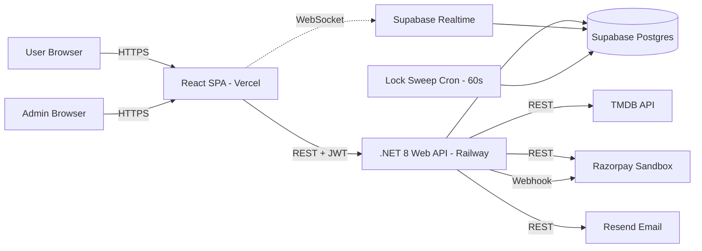
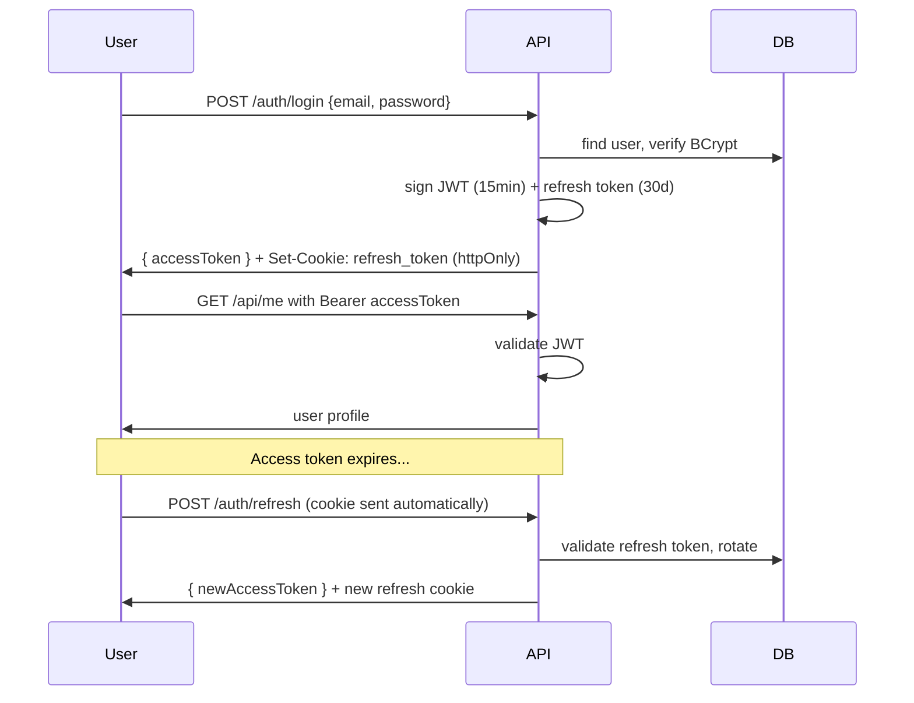

# BookKaroo — Architecture

## 1. System Overview



## 2. Layered Architecture

### Backend (.NET 8)

```
TicketVerse.Api          ← HTTP layer (controllers, middleware, auth)
   │
TicketVerse.Application  ← Business logic (services, DTOs, validators, interfaces)
   │
TicketVerse.Domain       ← Pure entities, enums, value objects (no dependencies)
   │
TicketVerse.Infrastructure ← EF Core, repositories, external API clients
```

**Dependency rule:** outer depends on inner. Domain depends on nothing. Infrastructure implements Application interfaces.

### Frontend (React)

```
src/
├── app/              ← Router, providers, global error boundary
├── features/         ← Feature modules (self-contained)
│   └── <feature>/
│       ├── api/      ← TanStack Query hooks
│       ├── components/
│       ├── hooks/
│       ├── pages/
│       ├── store/    ← Zustand store (if needed)
│       ├── types.ts
│       └── index.ts  ← public exports
└── shared/           ← Cross-feature: ui components, hooks, lib, types
```

**Rule:** features can import from `shared` but **never** from sibling features. Cross-feature data flows through `shared/api` or URL params.

## 3. Request Flow Examples

### A. Browse movies (read)
```
User → FE /movies → useMoviesQuery (TanStack)
     → GET /api/movies?city=X&genre=Y
     → MoviesController → MovieService → MovieRepository → DbContext
     → Postgres → ... → DTO[] → JSON → cached in TanStack Query → render
```

### B. Seat selection (real-time)
```
User opens seat page
   → GET /api/shows/{id}/seats (initial state)
   → subscribe to Supabase Realtime channel `show:{id}`
User clicks seat
   → POST /api/seat-locks { showId, seats[] }
   → SeatLockService:
        BEGIN TX
        SELECT pg_advisory_xact_lock(hash(seat_id))
        check seat not booked, not locked by other user
        INSERT seat_locks
        COMMIT
   → trigger publishes change to Realtime channel
   → other clients receive event → mark seat as locked
```

### C. Payment (idempotent)
```
User clicks Pay
   → POST /api/payments/order with Idempotency-Key header
   → check Idempotency table; if exists return cached response
   → PaymentService creates Razorpay order
   → return order_id, key_id to FE
   → FE opens Razorpay checkout
   → User pays in Razorpay modal
   → Razorpay calls webhook POST /api/payments/webhook
   → verify signature → mark payment captured → BookingService:
        BEGIN TX
        delete seat_locks
        INSERT bookings + booking_seats
        COMMIT
   → fire-and-forget: send email (Resend) with QR + invoice
   → return booking confirmation
```

## 4. Authentication



## 5. Seat Lock State Machine

```
[Available] --select--> [Locked by user] --pay success--> [Booked]
                          │
                          ├──timeout(8min)──> [Available]
                          └──user cancels───> [Available]
```

## 6. Caching Strategy
- **Client (TanStack Query):**
  - Movies list: `staleTime` 5min
  - Movie detail: 10min
  - Showtimes: 1min
  - User profile: until invalidate
- **Server:** ETag on movie/event detail responses
- **CDN:** Vercel auto-CDN for static FE assets

## 7. Logging & Observability
- **Backend:** Serilog → console (dev) + file (prod)
- **Correlation ID** middleware: every request tagged, propagated to external API calls
- **Health endpoint:** `/health` with DB ping
- **Frontend:** error boundary → console + (future) Sentry

## 8. Deployment Topology

```
Frontend (Vercel)        ← static + edge
   ↓
Backend (Railway)        ← single .NET service, autoscale
   ↓
Database (Supabase)      ← managed Postgres + Realtime + Storage
   ↓
Cron job (Railway)       ← seat lock sweep every 60s
```

## 9. Environment Configuration

### Backend `.env`
```
ASPNETCORE_ENVIRONMENT=Development
DATABASE_URL=postgres://...supabase...
JWT_SECRET=<256-bit>
JWT_ISSUER=bookkaroo
JWT_AUDIENCE=bookkaroo-api
JWT_ACCESS_TTL_MIN=15
JWT_REFRESH_TTL_DAYS=30
RAZORPAY_KEY_ID=rzp_test_...
RAZORPAY_KEY_SECRET=...
RAZORPAY_WEBHOOK_SECRET=...
RESEND_API_KEY=re_...
RESEND_FROM=tickets@bookkaroo.com
TMDB_API_KEY=...
SUPABASE_URL=https://....supabase.co
SUPABASE_SERVICE_ROLE_KEY=...
CORS_ALLOWED_ORIGINS=http://localhost:5173,https://bookkaroo.vercel.app
```

### Frontend `.env`
```
VITE_API_URL=http://localhost:5000
VITE_SUPABASE_URL=https://....supabase.co
VITE_SUPABASE_ANON_KEY=...
VITE_RAZORPAY_KEY_ID=rzp_test_...
VITE_GOOGLE_MAPS_API_KEY=...   # phase 2
```

## 10. Scalability Path (Phase 2+)

- Add Redis for seat locks (replace `seat_locks` table) — easy swap behind interface
- Read replicas for movie/event browse traffic
- Object storage (Supabase Storage already) for posters, QR codes
- CDN for posters
- Background job queue (Hangfire) for emails, scheduled reminders
- Rate limit middleware globally (currently auth-only)
- Multi-region deploy if needed
