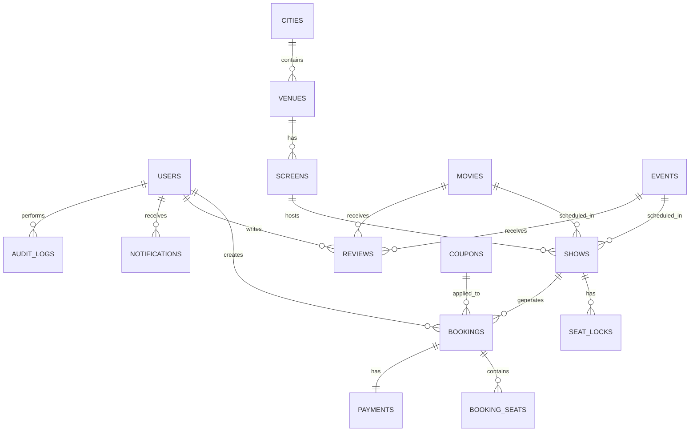

# BookKaroo — Database Schema

> **DB:** Supabase PostgreSQL | **No FKs** (logical references via UUID + indexes) | **3NF** | All tables soft-delete via `deleted_at`

## 1. Conventions
- All PKs: `id uuid DEFAULT gen_random_uuid() PRIMARY KEY`
- All tables: `created_at timestamptz DEFAULT now()`, `updated_at timestamptz DEFAULT now()`, `deleted_at timestamptz NULL`
- snake_case columns, plural table names
- Money: `numeric(10,2)`
- Indexes: every `*_id` column + frequently filtered columns
- Trigger `set_updated_at` on every table

## 2. ERD



## 3. Tables

### users
| Column | Type | Notes |
|---|---|---|
| id | uuid PK | |
| email | text UNIQUE | |
| mobile | text UNIQUE | |
| password_hash | text | BCrypt |
| name | text | |
| dob | date | |
| gender | text | enum: male/female/other/prefer_not |
| city_id | uuid | logical ref → cities |
| profile_pic_url | text | |
| role | text | enum: user/admin (default user) |
| email_verified | boolean | default false |
| preferences | jsonb | language, genre, notifications |
| is_blocked | boolean | default false |
| created_at, updated_at, deleted_at | | |

**Indexes:** email, mobile, city_id, role

---

### cities
| Column | Type |
|---|---|
| id | uuid PK |
| name | text |
| slug | text UNIQUE |
| state | text |
| country | text default 'IN' |
| latitude | numeric(9,6) |
| longitude | numeric(9,6) |
| is_active | boolean default true |
| created_at, updated_at, deleted_at | |

**Indexes:** slug, name

---

### venues
| Column | Type | Notes |
|---|---|---|
| id | uuid PK | |
| name | text | |
| slug | text UNIQUE | |
| chain | text | PVR, INOX, Cinepolis, etc |
| address | text | |
| city_id | uuid | logical ref |
| latitude | numeric(9,6) | |
| longitude | numeric(9,6) | |
| amenities | jsonb | array of strings |
| contact_phone | text | |
| contact_email | text | |
| created_at, updated_at, deleted_at | | |

**Indexes:** city_id, chain, slug

---

### screens
| Column | Type | Notes |
|---|---|---|
| id | uuid PK | |
| venue_id | uuid | logical ref |
| name | text | "Audi 1", "Screen 3" |
| layout | jsonb | { rows, cols, categories[], blockedSeats[] } |
| total_seats | int | |
| created_at, updated_at, deleted_at | | |

**Layout JSON example:**
```json
{
  "rows": 12,
  "cols": 18,
  "categories": [
    { "name": "Recliner", "rows": ["A","B"], "price": 450, "color": "#FFD700" },
    { "name": "Gold", "rows": ["C","D","E"], "price": 300, "color": "#C0C0C0" },
    { "name": "Executive", "rows": ["F","G","H","I"], "price": 200, "color": "#4169E1" },
    { "name": "Normal", "rows": ["J","K","L"], "price": 150, "color": "#FFFFFF" }
  ],
  "blockedSeats": ["A1","A2","L17","L18"],
  "aisleAfterCols": [4, 14]
}
```

**Indexes:** venue_id

---

### movies
| Column | Type | Notes |
|---|---|---|
| id | uuid PK | |
| tmdb_id | int | nullable |
| title | text | |
| slug | text UNIQUE | |
| description | text | |
| duration_min | int | |
| languages | text[] | |
| formats | text[] | 2D, 3D, IMAX |
| genres | text[] | |
| cast | jsonb | [{ name, role, photo }] |
| crew | jsonb | [{ name, role }] |
| certificate | text | U/UA/A |
| release_date | date | |
| poster_url | text | |
| backdrop_url | text | |
| trailer_url | text | YouTube |
| imdb_rating | numeric(3,1) | |
| status | text | draft/published/archived |
| category | text | now_showing/coming_soon/exclusive/premiere |
| created_at, updated_at, deleted_at | | |

**Indexes:** slug, status, category, release_date, tmdb_id

---

### events
| Column | Type | Notes |
|---|---|---|
| id | uuid PK | |
| title | text | |
| slug | text UNIQUE | |
| type | text | live_event/play/sport/activity/comedy/ipl |
| description | text | |
| venue_id | uuid | logical ref (events may have non-cinema venues) |
| event_date | timestamptz | |
| duration_min | int | |
| language | text | |
| age_restriction | int | min age |
| organizer | jsonb | { name, contact } |
| artists | jsonb | array |
| poster_url | text | |
| backdrop_url | text | |
| price_tiers | jsonb | [{ name, price, capacity }] |
| status | text | draft/published/archived |
| created_at, updated_at, deleted_at | | |

**Indexes:** slug, type, status, event_date, venue_id

---

### shows
| Column | Type | Notes |
|---|---|---|
| id | uuid PK | |
| screen_id | uuid | logical ref (nullable for events at non-screen venues) |
| venue_id | uuid | logical ref (denormalized for fast filtering) |
| movie_id | uuid | logical ref (one of movie_id or event_id set) |
| event_id | uuid | logical ref |
| show_date | date | |
| show_time | time | |
| show_datetime | timestamptz | computed = show_date + show_time, indexed |
| format | text | 2D/3D/IMAX/etc |
| language | text | |
| price_overrides | jsonb | optional override on screen layout categories |
| status | text | scheduled/cancelled/completed |
| created_at, updated_at, deleted_at | | |

**Indexes:** screen_id, venue_id, movie_id, event_id, show_datetime, status

---

### seat_locks
| Column | Type | Notes |
|---|---|---|
| id | uuid PK | |
| show_id | uuid | logical ref |
| seat_label | text | "A1", "B5" |
| user_id | uuid | logical ref |
| session_id | text | for guest pre-auth checkout |
| expires_at | timestamptz | now() + 8min |
| created_at | | |

**Indexes:** show_id, seat_label, expires_at, user_id
**Unique partial index:** `(show_id, seat_label) WHERE expires_at > now()` — prevents double-lock at DB level

---

### bookings
| Column | Type | Notes |
|---|---|---|
| id | uuid PK | |
| booking_ref | text UNIQUE | BK-YYYYMMDD-XXXXX |
| user_id | uuid | logical ref |
| show_id | uuid | logical ref |
| subtotal | numeric(10,2) | |
| convenience_fee | numeric(10,2) | |
| gst | numeric(10,2) | |
| discount | numeric(10,2) | default 0 |
| total | numeric(10,2) | |
| coupon_id | uuid | logical ref, nullable |
| status | text | pending/confirmed/cancelled/refunded |
| qr_code_url | text | Supabase Storage URL |
| cancelled_at | timestamptz | |
| created_at, updated_at, deleted_at | | |

**Indexes:** booking_ref, user_id, show_id, status, created_at

---

### booking_seats
| Column | Type |
|---|---|
| id | uuid PK |
| booking_id | uuid (logical ref) |
| seat_label | text |
| category | text |
| price | numeric(10,2) |
| created_at | |

**Indexes:** booking_id

---

### payments
| Column | Type | Notes |
|---|---|---|
| id | uuid PK | |
| booking_id | uuid | logical ref |
| razorpay_order_id | text | |
| razorpay_payment_id | text | nullable until success |
| razorpay_signature | text | |
| amount | numeric(10,2) | |
| currency | text default 'INR' | |
| method | text | upi/card/netbanking |
| status | text | created/captured/failed/refunded |
| idempotency_key | text UNIQUE | |
| refund_id | text | |
| refund_amount | numeric(10,2) | |
| webhook_payload | jsonb | last webhook |
| created_at, updated_at | | |

**Indexes:** booking_id, razorpay_order_id, razorpay_payment_id, status, idempotency_key

---

### reviews
| Column | Type | Notes |
|---|---|---|
| id | uuid PK | |
| user_id | uuid | logical ref |
| movie_id | uuid | logical ref, nullable |
| event_id | uuid | logical ref, nullable |
| rating | int | 1-10 |
| title | text | |
| body | text | |
| thumbs_up | int default 0 | |
| thumbs_down | int default 0 | |
| is_verified_booking | boolean default false | |
| status | text default 'published' | published/hidden/reported |
| created_at, updated_at, deleted_at | | |

**Indexes:** user_id, movie_id, event_id, status, created_at

---

### coupons
| Column | Type | Notes |
|---|---|---|
| id | uuid PK | |
| code | text UNIQUE | |
| type | text | flat/percent/bogo |
| value | numeric(10,2) | |
| max_discount | numeric(10,2) | for % type |
| min_order | numeric(10,2) | |
| valid_from | timestamptz | |
| valid_to | timestamptz | |
| usage_limit_per_user | int | |
| total_usage_limit | int | |
| current_usage | int default 0 | |
| applicable_cities | uuid[] | |
| applicable_movies | uuid[] | |
| applicable_venues | uuid[] | |
| is_active | boolean default true | |
| created_at, updated_at, deleted_at | | |

**Indexes:** code, valid_from, valid_to, is_active

---

### notifications
| Column | Type |
|---|---|
| id | uuid PK |
| user_id | uuid (logical ref) |
| type | text |
| title | text |
| body | text |
| data | jsonb |
| is_read | boolean default false |
| sent_via | text[] (email/whatsapp/in_app) |
| created_at, updated_at | |

**Indexes:** user_id, is_read, type

---

### cms_banners
| Column | Type |
|---|---|
| id | uuid PK |
| title | text |
| image_url | text |
| link_url | text |
| position | int |
| is_active | boolean default true |
| starts_at | timestamptz |
| ends_at | timestamptz |
| created_at, updated_at, deleted_at | |

---

### settings
| Column | Type | Notes |
|---|---|---|
| key | text PK | |
| value | jsonb | |
| updated_at | | |

Seeded keys: `convenience_fee`, `gst_rate`, `cancellation_policy`, `email_templates`

---

### audit_logs
| Column | Type |
|---|---|
| id | uuid PK |
| user_id | uuid (logical ref, nullable for system) |
| action | text |
| entity_type | text |
| entity_id | uuid |
| before | jsonb |
| after | jsonb |
| ip | text |
| user_agent | text |
| created_at | |

**Indexes:** user_id, entity_type, entity_id, created_at

---

### idempotency_keys
| Column | Type |
|---|---|
| key | text PK |
| user_id | uuid (logical ref) |
| endpoint | text |
| response | jsonb |
| status_code | int |
| created_at | timestamptz (TTL 24h) |

---

## 4. Seed Data Plan

| Table | Count | Source |
|---|---|---|
| cities | 25 | hardcoded list from PRD |
| venues | 5 per major city (Mumbai, Delhi, Bangalore) | seeded |
| screens | 2-4 per venue | seeded with layout JSON |
| movies | 20 | TMDB API pull at seed time |
| events | 10 | seeded (5 IPL matches, 3 concerts, 2 plays) |
| shows | ~200 | generated for next 7 days |
| users | 1 admin + 5 test users | seeded |
| settings | 4 keys | seeded |

## 5. Critical Queries (Performance)

### Get showtimes for a movie in a city
```sql
SELECT s.*, v.name AS venue_name, v.amenities, sc.name AS screen_name
FROM shows s
JOIN venues v ON v.id = s.venue_id AND v.deleted_at IS NULL
JOIN screens sc ON sc.id = s.screen_id AND sc.deleted_at IS NULL
WHERE s.movie_id = $1
  AND v.city_id = $2
  AND s.show_date = $3
  AND s.status = 'scheduled'
  AND s.deleted_at IS NULL
ORDER BY v.name, s.show_time;
```
*Indexes used: shows(movie_id), shows(show_date), venues(city_id)*

### Get booked + locked seats for a show
```sql
SELECT seat_label, 'booked' AS state
FROM booking_seats bs
JOIN bookings b ON b.id = bs.booking_id
WHERE b.show_id = $1 AND b.status = 'confirmed'
UNION ALL
SELECT seat_label, 'locked' AS state
FROM seat_locks
WHERE show_id = $1 AND expires_at > now();
```

## 6. Maintenance Jobs

| Job | Schedule | Purpose |
|---|---|---|
| Sweep expired seat locks | every 60s | DELETE FROM seat_locks WHERE expires_at < now() |
| Sweep expired idempotency keys | hourly | DELETE FROM idempotency_keys WHERE created_at < now() - 24h |
| Mark past shows completed | every 15min | UPDATE shows SET status='completed' WHERE show_datetime < now() AND status='scheduled' |
| Clean orphan rows (no FKs!) | nightly | service-layer integrity check |
