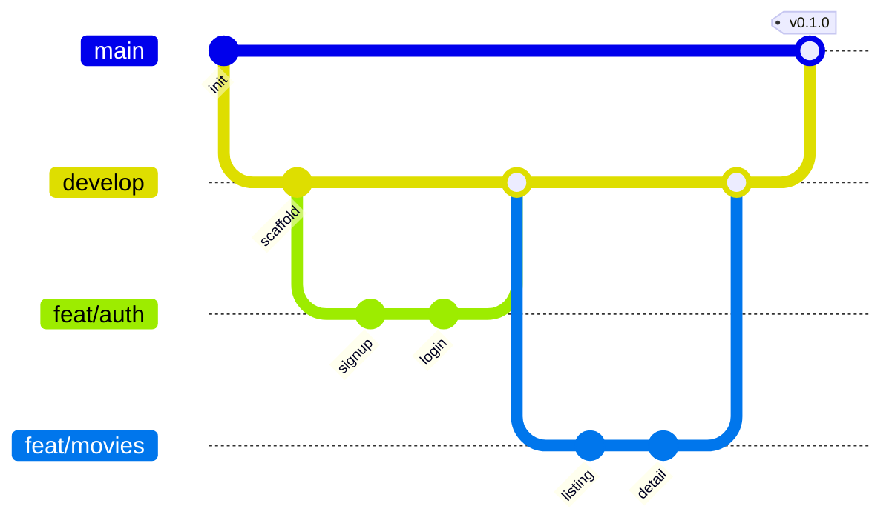

# BookKaroo — Git Workflow

## Branches
```
main      ← always production-ready, protected, no direct push
develop   ← integration branch, all features merge here first
feat/*    ← new features (one per scope)
fix/*     ← bug fixes
refactor/*← code improvements without behavior change
chore/*   ← tooling, deps, configs
docs/*    ← documentation only
```

## Naming
```
feat/auth-signup
feat/movies-listing
fix/seat-lock-race
refactor/booking-service
chore/upgrade-dotnet
docs/api-update
```

## Flow



### Per-feature steps
1. `git checkout develop && git pull`
2. `git checkout -b feat/<scope>`
3. Implement → commit small logical chunks
4. Push: `git push -u origin feat/<scope>`
5. Open PR to `develop`
6. PR checks: tests pass, build succeeds, lint clean
7. Merge (squash) → delete branch

### Release to main
- After a sprint of features in `develop`, smoke test
- PR `develop` → `main` (no squash, preserve history)
- Tag: `git tag v0.1.0 && git push --tags`

## Commit Messages (Conventional Commits)

```
<type>(<scope>): <subject>

[optional body]
[optional footer]
```

### Types
- `feat` – new feature
- `fix` – bug fix
- `refactor` – code change that neither fixes a bug nor adds a feature
- `chore` – tooling/build/deps
- `docs` – documentation only
- `test` – test additions or changes
- `style` – formatting (no logic)
- `perf` – performance improvement

### Examples
```
feat(auth): add JWT refresh token rotation
fix(booking): prevent duplicate seat lock under concurrent select
refactor(movies): extract genre filter to custom hook
chore(deps): bump dotnet to 8.0.4
docs(api): update payments endpoint contract
test(booking): add integration test for cancellation flow
```

### Rules
- Subject in imperative mood, ≤ 72 chars, no period
- Body wraps at 72 chars
- Reference issues in footer: `Closes #42`

## Pull Request Template
```markdown
## What
Brief description of the change.

## Why
Context: which requirement/issue this addresses.

## How
Approach summary, key decisions.

## Screenshots / Recordings
(for UI changes)

## Test Plan
- [ ] Unit tests added/updated
- [ ] Manually tested locally
- [ ] Edge cases considered

## Checklist
- [ ] Branch up-to-date with develop
- [ ] No console.log / Debug.WriteLine left
- [ ] /docs updated if API/schema changed
- [ ] No secrets committed
```

## Protected Branches
- `main`: require PR, require passing checks, no direct push
- `develop`: require PR, allow admin override

## Hotfix Flow
```
main → hotfix/<scope> → fix → PR to main + cherry-pick to develop
```

## Tagging
- Semver: `vMAJOR.MINOR.PATCH`
- Phase 1 MVP launch: `v1.0.0`
- Increments per release

## .gitignore essentials
- `node_modules/`, `dist/`, `bin/`, `obj/`
- `.env`, `.env.*` (keep `.env.example`)
- `*.log`, `.DS_Store`, `Thumbs.db`
- IDE: `.vscode/`, `.idea/` (allow shared via `.vscode/settings.json` if intentional)
